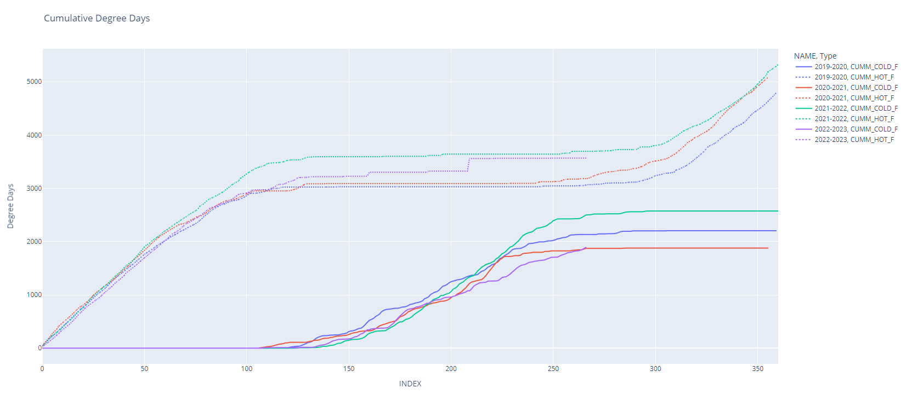

# Freeze Tracker

Freeze Tracker is a Python project for tracking freeze issues in Ely, Minnesota.

_This repo is under active development_ 




## Recommended

- VS Code
- VS Code Extension Python by Microsoft

## Project Management

The project uses `pyproject.toml` to manage its dependencies and build configuration. 
This allows for consistent package management across different environments.

In addition, the project utilizes a `Justfile` to define command recipes 
for convenience and repeatability. 
This helps to automate common development tasks and ensures 
consistency in the project's workflow.

## Historical Data (Year starts July 1)

Weather Underground for Hibbing provides some data.

- https://www.wunderground.com/history/monthly/us/mn/hibbing/KHIB/date/2023-4

NOAA information for Ely, MN was available with help from the NOAA staff.

- https://www.ncei.noaa.gov/access/past-weather/
- https://www.ncdc.noaa.gov/cdo-web/datasets
- https://www1.ncdc.noaa.gov/pub/data/ghcn/daily/readme.txt
- STATION DETAILS Name	ELY MINNESOTA, MN US
- Network:ID	GHCND:USR0000MELY
- Latitude/Longitude	47.8833°, -91.8667° Elevation	443.5 m

MN provides frost/freeze data by county. For St. Louis County, it's from Orr.

https://www.dot.state.mn.us/loadlimits/frost-thaw/orr.html


## Installation

Install some content globally for best results. 
Install these to your default Python:

```shell
python --version
python -m pip install --upgrade pip
python -m pip install panel panel[pyodide] hvplot jupyterlab
python -m pip install black ruff
```

Install the Just command runner. For example, on Windows using Chocolatey:

1. Open PowerShell Core as an Administrator
2. Run the following command: `choco install just -y`

Note that if you have both PowerShell Core and Windows PowerShell installed, 
it's important to run this command in PowerShell Core.
When using Just in VS Code, 
remember to choose the PowerShell Core Terminal.

## Create a Virtual Environment

```shell
python -m venv .venv
```

When VS Code Python Extension offers to select the Environment, say Yes.

## Activate the Virtual Environment

Activate it on Windows: `.venv\Scripts\activate`

Activate it on macOS/Linux `source .venv/bin/`

To deactivate, run `deactivate`.

## Install Dependencies

Install dependencies from pyproject.toml. The -e flag installs in editable mode.
Editable mode allows making changes to the source code and having those changes
reflected in the installed package without having to reinstall the package.

```powershell
python -m pip install --upgrade pip build setuptools wheel 
just install
```

## Run the Main App

```powershell
cd src/freezetracker
panel serve --show app.py
```

## Convert the Main App to Host on GitHub Pages

```powershell
panel convert app.py --to pyodide-worker --out docs
```

## Python Notes 

Default Python 3.11 paths on Windows:

- C:\Program Files\Python311\python.exe
- C:\Users\USERNAME\AppData\Local\Programs\Python\Python311\python.exe

The official Python installer for Windows 
has a default installation location in AppData to ensure each user 
on the machine has their own Python to customize without affecting other users.
If you did not change the installation location during Python installation, 
it's likely that Python installed in the default location.

## pip check

```
pip install pip-tools
pip list --outdated --format=columns
pip-check
```


## Checking Versions and Updating

```
ruff --version
poetry update ruff
```

`python -m pip install`  ensures that pip is installed 
and executed within the context of the same Python installation 
that is being used to run the command. 
It helps avoid conflicts with multiple versions of 
Python or pip on a system.

`python -m pip install -e .` installs the package(s) in 
editable mode or "development mode". 
This creates a symbolic link to the source code directory in your 
Python installation's site-packages directory, rather than copying files 
into the site-packages directory.

`pip install --upgrade build` is used to upgrade the Python package build, 
which is a package that provides support for building and 
distributing Python packages.

`just install` uses the Just command runner to run the install recipe defined
in the Justfile. 

## Plotly Dash

- [Dash](https://dash.plotly.com/)


## TODO

- Add tests
- Fix month start
- consider overlaying
- add historical event dates

## Preview


